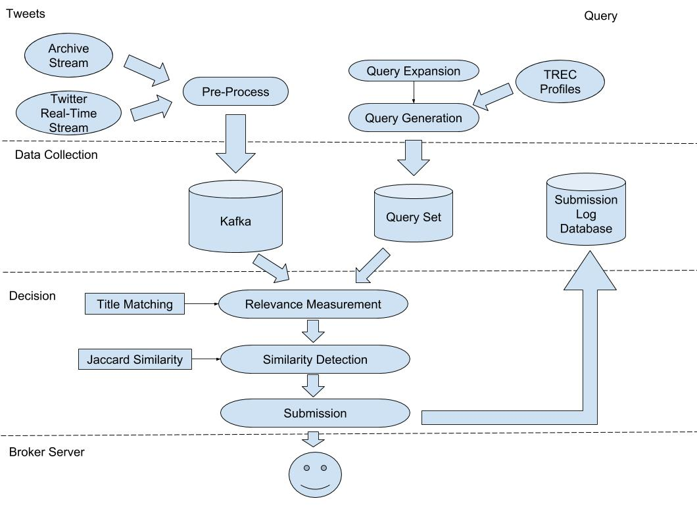

# RTS-YoGosling

RTS-YoGosling is a Python project running under the scenario of [TREC Real-Time Summarization (RTS) Track](http://trecrts.github.io/).

The official RTS track participating system will "listen" to the Twitter sample stream using the Twitter streaming API. To help replay the system after the official evaluation period of RTS, we also support reading from an 
archive file from disk. 

Here is our system overview.




##1. Installation
### Installing Kafka:
Our system is using Kafka to store tweet candidates. Thus, Kafka needs to be installed and started before running.

Kafka installation follows **Step 1** [here](https://kafka.apache.org/quickstart). 
### Package Requirements:
* [twython](https://twython.readthedocs.io/en/latest/): Python wrapper for the Twitter API. Supports both normal and streaming Twitter APIs.
* [NLTK](https://www.nltk.org/): Natural Language Toolkit.
* [kafka-python](https://github.com/dpkp/kafka-python): Python client for the Apache Kafka distributed stream processing system.
* [BeautifulSoup](https://www.crummy.com/software/BeautifulSoup/bs4/doc/): Python library for pulling data out of HTML and XML files.
* [certifi](https://github.com/certifi/python-certifi): Curated collection of Root Certificates for validating the trustworthiness of SSL certificates while verifying the identity of TLS hosts.

##2. Starting Kafka Service

Following **Step 2** [here](https://kafka.apache.org/quickstart). 
```buildoutcfg
> cd kafka_2.11-1.1.0
> bin/zookeeper-server-start.sh config/zookeeper.properties
> bin/kafka-server-start.sh config/server.properties
```
##3. Build Kafka Topics
Our system  

[comment]: <> (System Overview Google Doc:)
[comment]: <> (https://docs.google.com/drawings/d/1cXnlvX4cQSX1yVulzVuHZX2xMGL_-y7AcHn7Ye9_uSI/edit?usp=sharing)

[comment]: <> (Kafka Documentation Google Doc:)
[comment]: <> (https://docs.google.com/document/d/1s4U9_PnZavxH_ryUaRa71rIB0OY6ixkkDpqPENsegIc/edit?usp=sharing)
